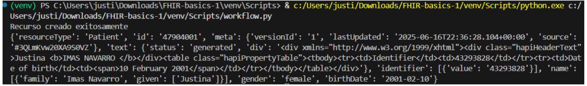
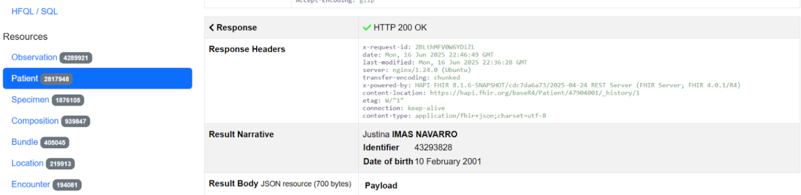
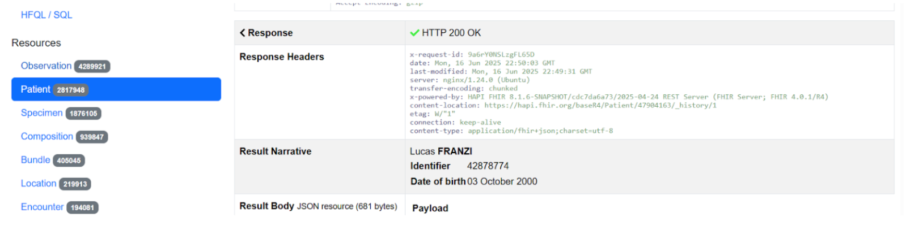
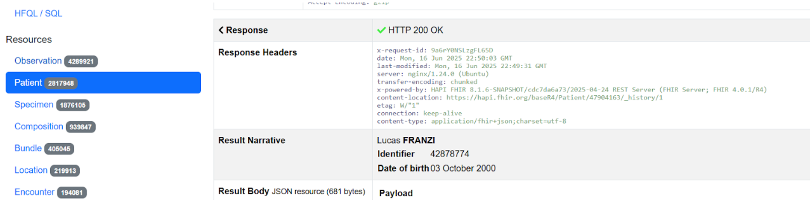
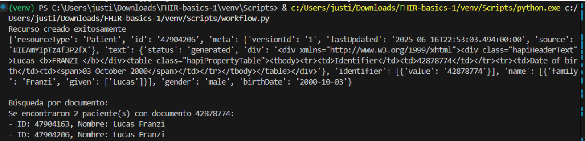
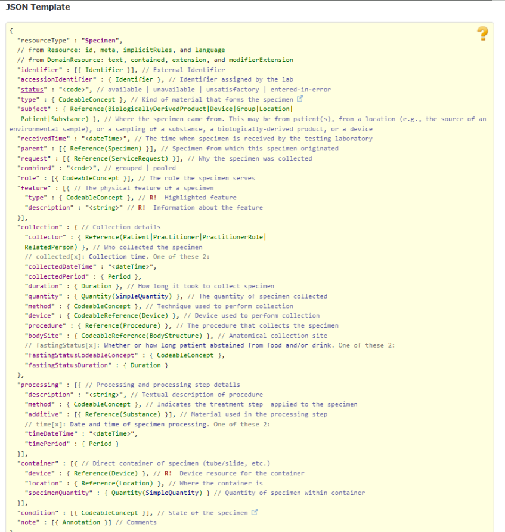
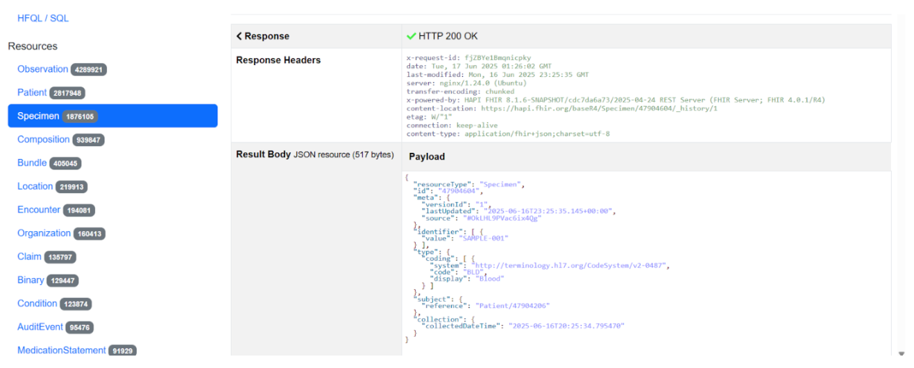

**ACTIVIDAD 3 (PYHTON):** 
Clonar el repo y usarlo como base para resolver las siguientes consignas. 
Además de explicar en el informe los procedimientos, crear un repositorio en Github y subir la actividad 3 a este. 
a. Crear un recurso patient con python. Incluir un número de documento como identifier. Luego, leer el recurso creado. 
b. Crear un método que permita buscar pacientes por documento. Encontrar el paciente creado anteriormente. 
c. A cada grupo le corresponde crear el recurso que coincida con el número de su grupo. 
Cada grupo deberá desarrollar su recurso utilizando Python, explicando brevemente para qué se utiliza y describiendo las partes principales del recurso. El recurso a crear debe incluir de mínima una relación con otro recurso. 

1. Device 
2. Immunization 
3. Service Request 
4. Care Team 
5. Specimen 
a) Primero para clonar el repositorio se ejecuta estas lineas en la terminal de Visual Code
```python
git clone https://github.com/euberrino/FHIR-basics.git
cd FHIR-basics
```
Una vez clonado el repositorio ejecutamos esta linea "python -m venv venv" la cual genera un entorno virtual, que es util en este caso porque se pide que se instalen requirements que pueden interferir con otros paquetes que tengamos instaladas
Si bien partimos de los codigos del repositorio los modificamos para que incluyan identifier
Modificamos patient.py agregando al final del codigo original una seccion para que se pueda agregar el documento como identifier
```python
from fhir.resources.patient import Patient
from fhir.resources.humanname import HumanName
from fhir.resources.contactpoint import ContactPoint
from fhir.resources.identifier import Identifier  
#Es importante en este renglon agregamos el identifier que va a ser donde ponemos el documento desp

def create_patient_resource(family_name=None, given_name=None, birth_date=None, gender=None, phone=None, identifier=None):
    patient = Patient()
    
    if family_name or given_name:
        name = HumanName()
        if family_name:
            name.family = family_name
        if given_name:
            name.given = [given_name]
        patient.name = [name]

    if birth_date:
        patient.birthDate = birth_date

    if gender:
        patient.gender = gender

    if phone:
        contact = ContactPoint()
        contact.system = "phone"
        contact.value = phone
        contact.use = "mobile"
        patient.telecom = [contact]

    # Agregar documento!!
    if identifier:
        doc = Identifier()
        doc.value = identifier
        patient.identifier = [doc]

    return patient
```
Y tambien modificamos el workflow para que incluya el identifier y poder crear el patient
```python
from Scripts.patient import create_patient_resource
from Scripts.base import send_resource_to_hapi_fhir, get_resource_from_hapi_fhir, search_patient_by_document

if __name__ == "__main__":
    family_name = "Imas Navarro"
    given_name = "Justina"
    birth_date = "2001-02-10"
    gender = "female"
    phone = None 
    identifier = "43293828"  # Documento

    # Crear recurso con identificador
    patient = create_patient_resource(family_name, given_name, birth_date, gender, phone, identifier)
    patient_id = send_resource_to_hapi_fhir(patient, 'Patient')

    if patient_id:
        get_resource_from_hapi_fhir(patient_id, 'Patient')
        print("\nBúsqueda por documento:")
        search_patient_by_document(identifier)
```
Una vez que ejecutamos el workflow podemos ver que dice recurso creado exitosamente

En la terminal dice el ID que es 47904001 asociado a la paciente Imas Navarro, Justina, si vamos a hapi fihr y lo cargamos en read podemos ver que se creo con exito 


Creamos otro paciente con Id 47904163 asociado al paciente Franzi, Lucas

b)

```python
import requests
from patient import create_patient_resource


# Enviar el recurso FHIR al servidor HAPI FHIR
def send_resource_to_hapi_fhir(resource,resource_type):
    url = f"http://hapi.fhir.org/baseR4/{resource_type}"
    headers = {"Content-Type": "application/fhir+json"}
    resource_json = resource.json()

    response = requests.post(url, headers=headers, data=resource_json)

    if response.status_code == 201:
        print("Recurso creado exitosamente")
        
        # Devolver el ID del recurso creado
        return response.json()['id']
    else:
        print(f"Error al crear el recurso: {response.status_code}")
        print(response.json())
        return None

# Buscar el recurso por ID 
def get_resource_from_hapi_fhir(resource_id, resource_type):
    url = f"http://hapi.fhir.org/baseR4/{resource_type}/{resource_id}"
    response = requests.get(url, headers={"Accept": "application/fhir+json"})

    if response.status_code == 200:
        resource = response.json()
        print(resource)
    else:
        print(f"Error al obtener el recurso: {response.status_code}")
        print(response.json())

# Con esta funcion podemos buscar por el identifier que en este caso es el documento 
def search_patient_by_document(identifier_value):
    url = f"https://hapi.fhir.org/baseR4/Patient?identifier={identifier_value}"
    response = requests.get(url, headers={"Accept": "application/fhir+json"})

    if response.status_code == 200:
        data = response.json()
        entries = data.get("entry", [])
        if entries:
            print(f"Se encontraron {len(entries)} paciente(s) con documento {identifier_value}:")
            for entry in entries:
                patient = entry["resource"]
                pid = patient.get("id", "ID no disponible")
                name = patient.get("name", [{}])[0]
                full_name = f"{' '.join(name.get('given', []))} {name.get('family', '')}"
                print(f"- ID: {pid}, Nombre: {full_name}")
        else:
            print(f"No se encontró ningún paciente con documento {identifier_value}")
    else:
        print(f"Error al buscar paciente: {response.status_code}")
```
Si la llamamos desde workflow se ve en la terminal 

lo cual tiene sentido porque primero se ejecuta la creacion del paciente y luego busca por documento, como el codigo se habia ejecutado previamente, encuentra dos pacientes con el mismo documento, pero cabe destacar que cada vez que se ejecuta el codigo se le asigna un id distinto

c) Specimen representa una muestra biológica obtenida de un paciente con fines diagnósticos o de investigación. En este caso, se creó una muestra de sangre (Blood) relacionada al recurso Patient previamente generado (ID: 47904206), cumpliendo así con el requisito de establecer al menos una relación entre recursos.

 Primero buscamos la estructura de “specimen” en HL7-fihr


Esta es la estructura que deberia cumplir a grandes rasgos ya que no todo es requerido
Generamos entonces un codigo para specimen
```python
from fhir.resources.specimen import Specimen
from fhir.resources.reference import Reference
from fhir.resources.identifier import Identifier
from fhir.resources.codeableconcept import CodeableConcept
from fhir.resources.coding import Coding
from datetime import datetime

def create_specimen_resource(patient_id=None):
    specimen = Specimen()
    # ID del paciente relacionado
    if patient_id:
        patient_ref = Reference()
        patient_ref.reference = f"Patient/{patient_id}"
        specimen.subject = patient_ref
    # Tipo de muestra (sangre)
    specimen.type = CodeableConcept(
        coding=[Coding(system="http://terminology.hl7.org/CodeSystem/v2-0487", code="BLD", display="Blood")]
    )
    # Fecha de recolección
    specimen.collection = {
        "collectedDateTime": datetime.now().isoformat()
    }
    # Identificador único para la muestra
    identifier = Identifier()
    identifier.value = "SAMPLE-001"
    specimen.identifier = [identifier]

    return specimen
```
Buscamos el codigo de specimen de sangre en https://terminology.hl7.org/6.4.0/CodeSystem-v2-0487.html para saber que code tiene
y un workflow que lo genere 
```python
from Scripts.specimen import create_specimen_resource
from Scripts.base import send_resource_to_hapi_fhir, get_resource_from_hapi_fhir

if __name__ == "__main__":
    # Con el ID se relaciona al paciente
    patient_id = "47904206"  

    specimen = create_specimen_resource(patient_id)
    specimen_id = send_resource_to_hapi_fhir(specimen, 'Specimen')

    if specimen_id:
        get_resource_from_hapi_fhir(specimen_id, 'Specimen')
```
Una vez ejecutado el workflow de specimen se genera el specimen asociado a un paciente por id
En hapi fihr podemos hacer un read con el ID que obtuvimos y vemos que se creo correctamente

